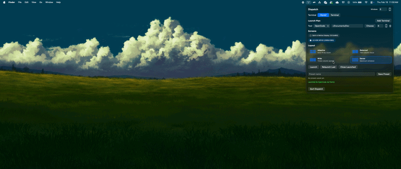

# Dispatch

Agentic engineering is here, but local orchestration has been missing.

You can spin up amazing coding agents, but launching and arranging 4, 6, or 12 coordinated terminals across tools and monitors is still too manual.
I built **Dispatch** to fix that.

Dispatch is a macOS menu bar mission control for multi-agent development sessions.

## Why Dispatch Exists

- Agentic workflows need parallelism, not one terminal at a time.
- Switching between tools should be easy (`claude`, `codex`, `opencode`, and more).
- Multi-screen setups should be first-class for coding sessions.
- Window management should be automatic, not a daily chore.

## What It Does

- Launches mixed tool sessions in one click (for example `4x Claude + 2x Codex`).
- Supports per-terminal directories in the same launch plan.
- Supports multiple terminal apps: `iTerm2` and `Terminal`.
- Uses all detected displays for tiling.
- Includes a clean display map preview for monitor arrangement context.
- Includes an active terminals board with focus + state controls.
- Highlights attention-needed terminals and supports quick `Focus Next Alert` navigation.
- Includes a visual layout picker (`Adaptive`, `Balanced`, `Wide`, `Dense`).
- Automatically detects and tracks existing terminal windows not launched by Dispatch.
- Uses wrapper-based prompt detection to auto-mark `needs_input` for common interactive prompts.
- Saves presets, relaunches last session, and closes only Dispatch-owned windows.

## Quick Start

Requirements:

- macOS 13+
- iTerm2 and/or Terminal
- Tool CLIs available in `PATH` (examples: `claude`, `codex`, `opencode`)
- macOS automation permission for terminal control

Run locally:

```bash
swift run
```

Build helper CLIs:

```bash
swift build --product dispatch-agent
swift build --product dispatchctl
```

## Build a Distributable App

```bash
./scripts/package_app.sh
```

Artifacts:

- `dist/Dispatch.app`
- `dist/Dispatch-macos.zip`

## How Launching Works

For each launch row, Dispatch runs a wrapper command:

```bash
dispatch-agent --tool <tool> --session-id <id> --agent-id <id> --command "<tool-command>"
```

Then windows are tiled across your selected displays.

## Human Handoff Signals

From any tracked terminal, you can explicitly ask for attention:

```bash
dispatchctl state needs_input --reason "Need approval before applying migration"
```

`dispatchctl` reads `DISPATCH_SESSION_ID` and `DISPATCH_AGENT_ID` automatically when launched by Dispatch.

## Contributing

PRs are open and very welcome.

If you want to contribute, great targets are:

- more terminal adapters
- better layout strategies
- preset sharing/import-export
- quality-of-life UX improvements

If you hit bugs or weird automation edge cases, open an issue with your macOS version, terminal app, and a short reproduction.

---

Built by someone who wanted agentic programming to feel like a control room, not a tab-management exercise.
